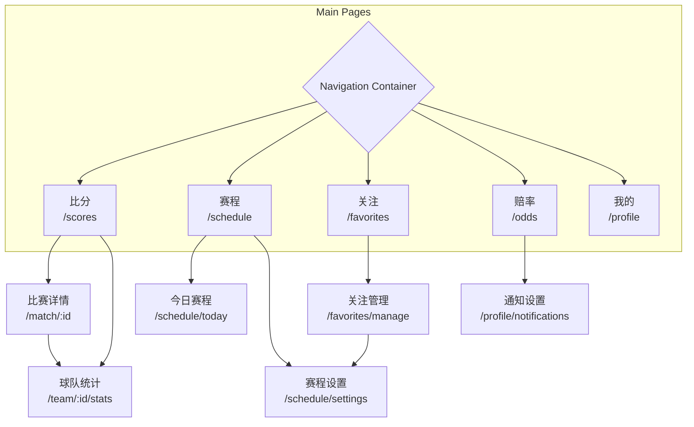

# User Flow — SportScore

```mermaid
graph TD
  %% Navigation Container (Max 4 pages)
  NavContainer{Navigation Container}

  %% Core Pages (accessible from main navigation)
  subgraph "Main Pages"
    NavContainer --> PageA["比分<br/>/scores"]
    NavContainer --> PageB["赛程<br/>/schedule"]
    NavContainer --> PageC["关注<br/>/favorites"]
    NavContainer --> PageD["赔率<br/>/odds"]
    NavContainer --> PageE["我的<br/>/profile"]
  end

  %% Detail and Action Pages (2 levels maximum)
  PageA --> PageA1["比赛详情<br/>/match/:id"]
  PageA --> PageA2["球队统计<br/>/team/:id/stats"]

  PageB --> PageB1["今日赛程<br/>/schedule/today"]
  PageB --> PageB2["赛程设置<br/>/schedule/settings"]

  PageC --> PageC1["关注管理<br/>/favorites/manage"]

  PageD --> PageD1["通知设置<br/>/profile/notifications"]

  %% Cross-page Navigation (when applicable)
  PageA1 --> PageA2
  PageC1 --> PageB2
```